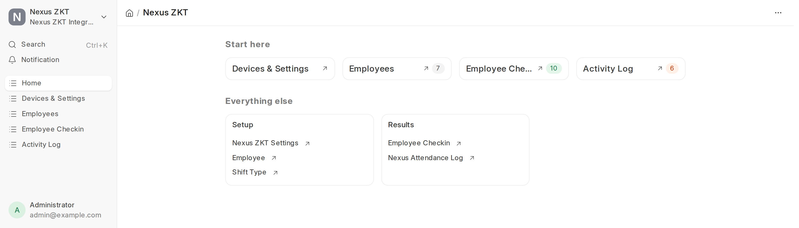
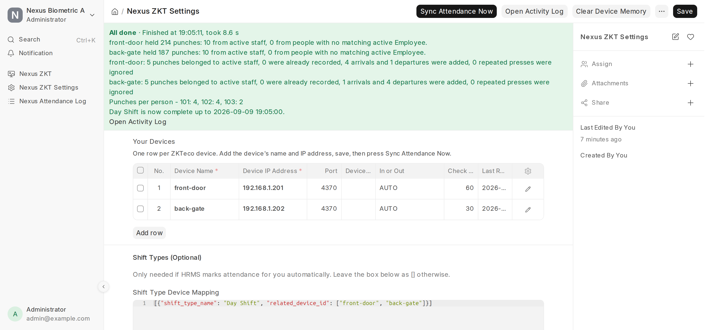
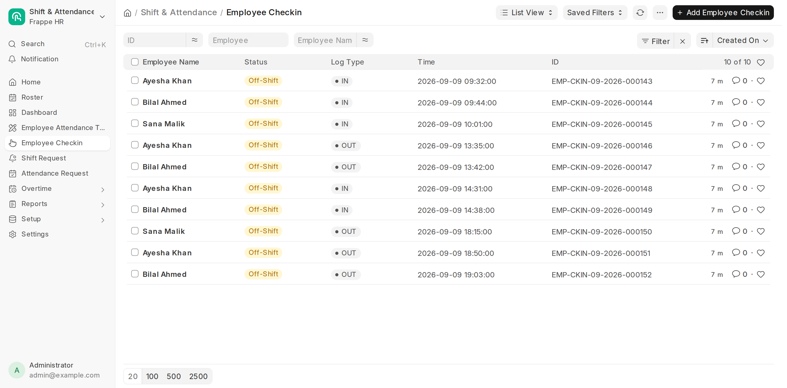
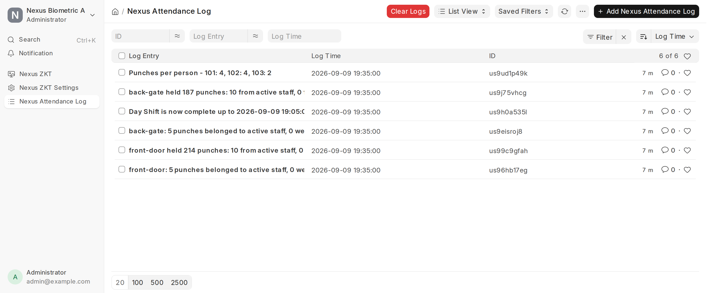
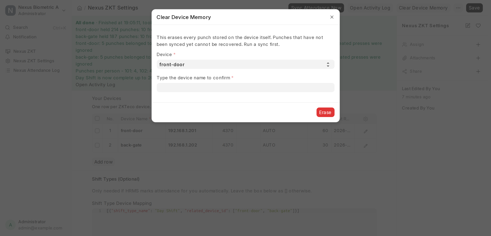
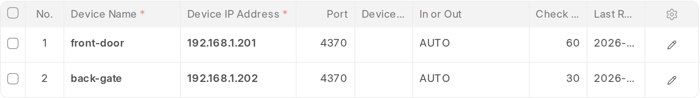

<div align="center">
  

  <h1>Nexus ZKT Integration</h1>

  <p><b>Your ZKTeco fingerprint machines, wired straight into ERPNext attendance.</b></p>

  <p>
    Punches go in one end, <b>Employee Checkin</b> records come out the other.<br>
    No exports, no spreadsheets, no typing. Front door and back door read as one day.
  </p>

  <p>
    
    
    
    
  </p>
</div>

---

## You are on the **version-15** branch

| Your ERPNext / HRMS | Branch to install |
|---|---|
| **Version 16** | [`version-16`](../../tree/version-16) |
| **Version 15** | `version-15` &nbsp;&larr; *you are here* |

Both branches carry the same features. Pick the one that matches the software you
already run.

---

## A look at it

Every screenshot below is the app running on a real ERPNext 16 site.

### One place for everything



### Your devices, and how the last run went



### The check-ins it writes

Three people, two doors, one day. The arrivals and departures alternate correctly
even though people came in the front and left by the back.



### Everything it did, written down



### Erasing a machine takes two deliberate steps



---

## What it does

Every run, for each device you have listed:

1. **Look up your people.** Collect the *Attendance Device ID* of every **Active**
   employee.
2. **Read the devices.** Pull each machine's attendance log and keep only those
   people's punches. Punches belonging to unknown or inactive users are ignored —
   nothing is stored for them.
3. **Write the check-ins.** Put every punch from every machine in one list in time
   order, then create one **Employee Checkin** each, marked **IN** or **OUT**. A
   punch that is already recorded is skipped, so running the sync twice never
   doubles anything.

Everything is written to the **Nexus Attendance Log**, so you can always see what
happened and why.

## What makes it different

- **More than one door is handled properly.** A person who walks in the front and
  out the back has one day, not two half-days. Every machine is read before any
  direction is decided. See [more than one door](#more-than-one-door).
- **Two machines can share one public address**, told apart by port — the usual
  shape of an office behind a single router.
- **Nothing is erased by accident.** A sync never touches a machine's memory.
  Clearing is a separate button that makes you type the device name back.
- **It never invents data.** No example device is created on install, so your log
  does not fill with failures pointing at an address nobody owns.
- **106 tests**, run against Frappe 15 and 16 on every push.

## What you need

- Frappe, ERPNext and **HRMS** version 15 (use the `version-16` branch for 16)
- The Python package `pyzk` — installed for you with the app
- Each device reachable from your server on its TCP port (4370 by default)
- Background workers running (`bench start` in development, supervisor in production)

Tested against ZKTeco F22 and K40; anything speaking the ZK SDK protocol should
behave the same.

## Install

```bash
cd $PATH_TO_YOUR_BENCH
bench get-app https://github.com/abbas0444/nexus_zkt_integration --branch version-15
bench --site your-site install-app nexus_zkt_integration
```

On **Frappe Cloud**, add the app to your bench and install it on your site from
the dashboard — no commands needed.

### Update

```bash
cd $PATH_TO_YOUR_BENCH/apps/nexus_zkt_integration && git pull
cd $PATH_TO_YOUR_BENCH
bench --site your-site migrate
bench --site your-site clear-cache
bench restart          # production only
```

## Set it up

Everything lives in one place: the **Nexus ZKT** workspace, or the app tile on
your `/apps` screen.

### 1. Add your devices

Open **Nexus ZKT Settings** and add one row per machine.



| Field | What to put in it |
|---|---|
| **Device Name** | Any name you like, e.g. `front-door`. It is saved on every check-in this device creates. |
| **Device IP Address** | The device's address on your network, e.g. `192.168.1.201`. |
| **Port** | Leave at `4370` unless your router forwards a second device to a different port. See [two devices, one address](#two-devices-one-address). |
| **Device Password** | Only if your device has a numeric communication key. Most do not — leave it empty. |
| **In or Out** | `AUTO` suits almost everyone. Use `IN` or `OUT` for a machine that only records one direction, or `None` to leave it blank. |
| **Check Every (Minutes)** | How long to wait before reading this device again on the hourly schedule. |
| **Last Read** | Filled in for you. Clear it to force the next scheduled run. |
| **Latitude / Longitude** | Optional. Copied onto each check-in. |

Then save.

### 2. Tell ERPNext who is who

On every **Employee**, fill in **Attendance Device ID** with that person's user ID
on the machine — the number the device shows as "User ID", not their name. Only
**Active** employees are read.

To list the users a device holds, run this from your bench folder (change the IP):

```bash
env/bin/python -c "
from zk import ZK
c = ZK('192.168.1.201', port=4370, password=0).connect()
for u in c.get_users(): print(u.user_id, '-', u.name)
c.disconnect()"
```

### 3. Set your Shift Type

In each **Shift Type**, set *Determine Check-in and Check-out* to
**Alternating entries as IN and OUT during the same shift**. This works whether or
not your device records a punch direction, and it is what the IN/OUT logic assumes.

## Running a sync

**The button.** Open **Nexus ZKT Settings** and press **Sync Attendance Now**. It
reads every device immediately, ignores the wait time, and shows a progress bar
while it works. If a sync is already going, it tells you instead of starting a
second one.

**Automatically.** The sync runs every hour and respects each device's
*Check Every (Minutes)*. Make sure the scheduler is on:

```bash
bench --site your-site scheduler enable
```

and that `pause_scheduler` is not `1` in `sites/common_site_config.json`.

**From the command line.**

```bash
bench --site your-site execute nexus_zkt_integration.nexus_biometric_attendance.api.collect_now
# ignore the wait time:
bench --site your-site execute nexus_zkt_integration.nexus_biometric_attendance.api.collect_now --kwargs "{'force': 1}"
```

## More than one door

Add one row per machine. A front door and a back door are two rows, and everyone
who uses either is handled as one person having one day.

That last part matters more than it sounds. Somebody walks in the front at nine,
out the back at one, in the front again at two, home out the back at six. If each
machine were read on its own, the front door would see only nine and two and call
the second one a departure, and the back door would get its half wrong too. So
every machine is read first, all the punches are put in **one list in time order**,
and only then is each one called an arrival or a departure. The order you list
your devices in makes no difference to the result.

Each machine still keeps its own **In or Out** setting. A common two-door setup is
an entry-only reader on the front and an exit-only reader on the back: set one to
`IN` and the other to `OUT`, and each says what it is while everything else
alternates around them.

Walking past two readers in the same lobby is one arrival, not an arrival and a
departure a minute apart — the two-minute rule applies across doors as well as
within one.

### Two devices, one address

Two machines cannot share an address on your network, but they very often share
one **public** address: the office router forwards port `4370` to the front door
and, say, `4371` to the back. Put the same IP on both rows and give each its own
**Port**.

| Device Name | Device IP Address | Port |
|---|---|---|
| `front-door` | `203.0.113.7` | `4370` |
| `back-gate` | `203.0.113.7` | `4371` |

Two rows with the same address **and** the same port are refused when you save:
that is one machine listed twice, and reading it under two names would file the
punches under whichever name came first, making the other door look broken.

## How IN and OUT are decided

Your device records a *punch direction* with every punch when its **Punch State**
option is switched on (on an F22: Menu → System → Attendance → Punch State Options
→ Manual or Auto). Directions `0` and `4` become **IN**, `1` and `5` become **OUT**.

Most machines are left with Punch State **off** and send `255` — no direction at
all. With **In or Out** set to `AUTO`, the direction is worked out per person,
across every door they used:

- the first punch is **IN**, the next **OUT**, the next **IN**, and so on;
- an **IN** more than **14 hours** old is treated as a day somebody forgot to close,
  so the next punch starts a fresh **IN** rather than closing yesterday;
- a second punch within **2 minutes** of the last one is the same finger twice and
  is ignored.

Both limits are `DEFAULT_OPEN_SHIFT_LIMIT` and `DEFAULT_REPEAT_WINDOW` at the top of
[`punch.py`](nexus_zkt_integration/nexus_biometric_attendance/punch.py).

Check-ins that already exist are never modified. If you want IN/OUT on check-ins
created before you installed this, delete them and sync again — the punches are
still on the device.

## Clearing a device

A sync **never** erases a machine's memory. Punches that have not reached ERPNext
yet exist nowhere else, and a wipe cannot be undone.

When a device does fill up, use **Clear Device Memory** on the settings form. It
asks you to pick the device and type its name back before it erases anything. Run
a sync first.

## The activity log

Every run writes to **Nexus Attendance Log**. The list has a **Clear Logs** button,
and the table empties itself once a week.

## When something is wrong

| What the log says | What it means |
|---|---|
| `Nothing was read: nobody active has an Attendance Device ID yet` | No Employee has that field filled in, or none are Active. See [step 2](#2-tell-erpnext-who-is-who). |
| `… from people with no matching active Employee` | Punches from device users who have no Active employee. Map them to bring their punches in. |
| `… was left alone: it is read every N minutes` | The scheduled run came too early. Use the button, pass `force`, or clear *Last Read*. |
| `[PROBLEM] Could not reach …` | The device did not answer. Check the IP and port, that the port is open, and that no other program is holding the connection. |
| `[WARNING] … the Device Password is not a number` | That field holds text. Clear it, or enter the numeric key. |
| `[REFUSED] … Transactions cannot be created for an Inactive Employee` | HRMS refused the punch because that employee is not Active. |
| Nothing happens after pressing the button | Background workers are not running (`bench worker` / supervisor), or the queue is paused. |

## Server and device on different networks

The connection goes **from your server to the device**. A server on the internet
cannot reach a device sitting on an office LAN address like `192.168.x.x`; the log
then shows `[PROBLEM] Could not reach … timed out`. Pick one:

**A. Port forwarding.** On the office router, forward TCP port 4370 to the device,
then use the office's public IP as the Device IP Address. For a second machine,
forward a different outside port to it and put that port in the **Port** field.
ZK devices have almost no authentication, so restrict the forward to your server's
IP if the router allows it.

**B. SSH reverse tunnel**, from any office PC that can reach both:

```bash
ssh -N -R 4370:<device-lan-ip>:4370 <user>@<your-server>
```

While that runs, set Device IP Address to `127.0.0.1`. For a permanent tunnel, run
it through `autossh` or a systemd service.

**C. VPN** (WireGuard, OpenVPN) between server and office. The most secure option;
the device keeps its LAN address.

## Good to know

- Device memory is limited — an F22 holds about 30,000 punches. Sync regularly, and
  clear a device once its punches are safely in ERPNext.
- This app can run alongside ZKTeco BioTime or ADMS push mode. Both read the same
  log; this one connects directly over the ZK protocol.
- Each device's own clock is used as-is. Keep them matching your server's timezone.
- Every DocType here is prefixed `Nexus`, so this app can sit on the same site as
  another ZK integration without the two fighting over the same tables.

## Documentation and support

- **[Wiki](../../wiki)** — setup walkthrough, multiple doors, troubleshooting, developer notes
- **[Issues](../../issues)** — bugs and feature requests
- **[Changelog](CHANGELOG.md)** — what changed in each release

## Licence

MIT — see [license.txt](license.txt). Free to use, change and sell.

<div align="center"><sub>Built and maintained by <b>Abbas Raza</b></sub></div>
